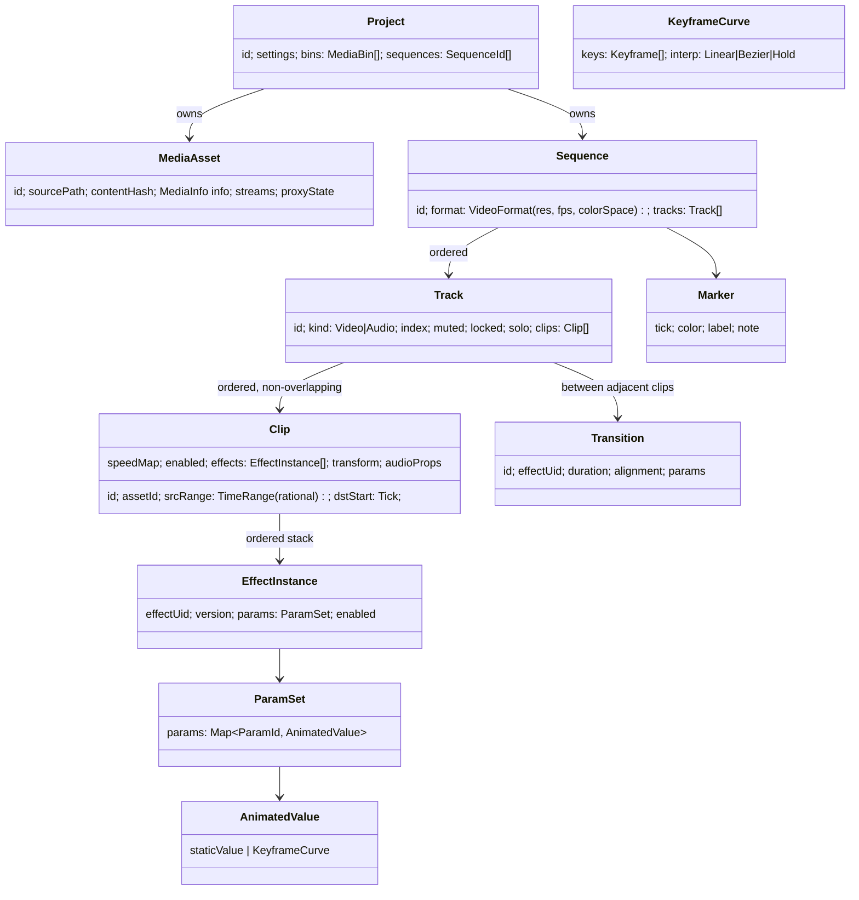

# 02 — System Architecture

## 1. Architectural Style

Layered core with a **compiler pipeline at its heart**: the timeline document is
*data*; playback and export are *programs compiled from that data*.

```
   ┌─────────────────────────────────────────────────────────────┐
   │  UI (Qt)          panels · timeline widget · inspector      │
   └───────────────▲─────────────────────────────┬───────────────┘
        snapshots  │                             │ commands
   ┌───────────────┴─────────────────────────────▼───────────────┐
   │  Application layer    document sessions · command bus ·     │
   │                       undo/redo · shortcuts · services      │
   └───────────────▲─────────────────────────────┬───────────────┘
                   │ immutable TimelineSnapshot  │
   ┌───────────────┴─────────────────────────────▼───────────────┐
   │  Engine                                                     │
   │   TimelineModel → SequenceCompiler → RenderGraph            │
   │   PlaybackEngine · ExportEngine · AudioEngine · CacheSystem │
   └───────▲──────────────▲──────────────▲──────────────▲────────┘
           │              │              │              │
   ┌───────┴────┐  ┌──────┴─────┐  ┌─────┴──────┐  ┌────┴───────┐
   │ media/     │  │ gpu/ (RHI) │  │ audio dev  │  │ fx/ plugin │
   │ FFmpeg abs │  │ D3D12      │  │ WASAPI     │  │ host       │
   └───────▲────┘  └──────▲─────┘  └─────▲──────┘  └────▲───────┘
   ┌───────┴──────────────┴──────────────┴──────────────┴────────┐
   │  Foundation   jobs · memory · log · time · fs · math · uuid │
   └──────────────────────────────────────────────────────────────┘
```

**Dependency rule:** arrows only point downward. `engine/` never includes Qt.
`foundation/` includes nothing of ours. Enforced by CMake target visibility +
an include-lint CI check.

## 2. The One Load-Bearing Decision: Immutable Timeline Snapshots

The single most consequential choice in this architecture:

- The timeline document is a **persistent (structurally shared) immutable data
  structure**. Every committed edit produces a new `TimelineSnapshot` (a cheap
  copy sharing unchanged nodes, `shared_ptr`-based).
- The UI thread owns mutation (via commands). Playback, render, audio, and
  export threads each hold a snapshot and **never take a lock** to read the
  timeline. They pick up new snapshots at safe points (frame boundaries) via an
  atomic pointer swap.
- Undo/redo is nearly free: keep previous snapshots (bounded) + the command
  log for semantic redo.
- Cache invalidation becomes tractable: every node carries a content hash;
  a new snapshot's changed subtree is exactly the set of dirty caches.

This kills the largest bug class in NLE engineering (timeline mutated while the
render thread walks it) *by construction*, at the cost of allocation discipline
(pooled nodes, see [08](08-concurrency-and-memory.md)).

## 3. Module Layout (repository folder hierarchy)

```
velocity/
├── CMakeLists.txt · CMakePresets.json · vcpkg.json
├── cmake/                     # toolchain, warnings, sanitizers, shader build
├── docs/                      # this documentation + adr/
├── external/                  # vcpkg overlay ports (ffmpeg, etc.)
├── shaders/                   # HLSL, compiled offline → shader pack
├── assets/                    # icons, themes, LUTs, presets, test media refs
├── src/
│   ├── foundation/            # zero-dependency base layer
│   │   ├── jobs/              #   JobSystem facade over oneTBB, JobHandle, TaskGraph
│   │   ├── memory/            #   arenas, pools, FramePool, budget tracker
│   │   ├── log/  time/  fs/  math/  uuid/  config/
│   ├── media/                 # FFmpeg abstraction (no engine deps)
│   │   ├── demux/  decode/  encode/  index/  probe/
│   │   ├── image/             #   WIC/WebP/SVG-rasterize importers
│   │   └── proxy/             #   proxy + optimized-media generation
│   ├── gpu/                   # RHI over D3D12
│   │   ├── rhi/               #   device, queues, resources, pipelines, fences
│   │   ├── d3d12/             #   the only backend for now
│   │   ├── shadersys/         #   shader cache, permutations
│   │   └── interop/           #   D3D11-on-12, decoder surface import
│   ├── engine/
│   │   ├── model/             #   TimelineSnapshot, Sequence, Track, Clip, Keyframes
│   │   ├── commands/          #   edit commands, transaction, undo stack
│   │   ├── compile/           #   SequenceCompiler → FrameGraph/AudioGraph
│   │   ├── graph/             #   RenderGraph nodes, scheduler, executor
│   │   ├── playback/          #   PlaybackEngine, clocks, prefetch, drop logic
│   │   ├── audio/             #   mixer graph, DSP nodes, metering
│   │   ├── cache/             #   RAM/VRAM/disk caches, hash keys, eviction
│   │   ├── export/            #   ExportEngine, render queue, muxing
│   │   ├── text/              #   shaping, layout, glyph atlas, title model
│   │   └── project/           #   SQLite persistence, autosave, recovery, assets
│   ├── fx/                    # built-in effects/transitions as plugin-shaped units
│   │   ├── api/               #   the C plugin ABI headers (single source of truth)
│   │   ├── color/  blur/  key/  transform/  transitions/  audiofx/
│   ├── app/                   # application layer (no Qt widgets, but owns Qt event loop glue)
│   │   ├── session/           #   DocumentSession, command bus, dirty tracking
│   │   ├── services/          #   thumbnails, waveforms, fonts, recent projects
│   │   └── shortcuts/         #   keymap model, command palette registry
│   ├── ui/                    # Qt 6 widgets
│   │   ├── shell/             #   main window, docking, theming
│   │   ├── timeline/          #   custom-rendered timeline widget
│   │   ├── preview/           #   swapchain host widget, transport controls
│   │   ├── bin/  inspector/  mixer/  exportdlg/  settings/
│   └── main/                  # exe entry, crash handler init, single-instance
├── plugins/                   # out-of-tree sample plugins (v2)
├── tests/
│   ├── unit/  integration/  render_approval/  perf/
│   └── media_corpus/          # scripts to fetch the versioned test-media set
└── tools/                     # media-corpus fetcher, shader tool, project inspector CLI
```

Each `src/` top-level folder is a static library CMake target with an explicit
public include dir; `main/` links them. Plugin ABI headers in `fx/api` are pure
C and shared with external plugins later.

## 4. Core Class Model (engine/model)



Key invariants:
- **Time is rational.** All positions/durations are `Tick = int64` at a fixed
  sequence timebase (e.g., 1/48000 s master tick — divisible by common frame
  rates and the audio rate). Floating-point time is banned in the model.
  Source-media positions use the stream's own rational timebase, mapped
  explicitly.
- Clips within a track never overlap; overlaps are expressed as separate tracks
  or transitions. The magnetic-feel behaviors are edit-command logic, not model
  properties.
- Every model node is immutable after construction and carries
  `contentHash = xxh3(children hashes + own fields)` for cache keys.
- Nested timelines: a `Clip` may reference a `SequenceId` instead of a
  `MediaAsset` (v1.x — the reference form is in the schema from day one).

## 5. Command & Undo Model

```mermaid
sequenceDiagram
    participant UI
    participant Session as DocumentSession (UI thread)
    participant Model as TimelineSnapshot
    participant Engines as Playback/Audio/Export

    UI->>Session: execute(SplitClipCommand{clip, tick})
    Session->>Model: apply → new snapshot S(n+1) (structural sharing)
    Session->>Session: push undo entry {S(n), command meta}
    Session->>Engines: publish S(n+1) (atomic ptr, seqlock epoch)
    Session-->>UI: model-changed events (diff of changed node ids)
    Engines->>Engines: adopt S(n+1) at next frame boundary; diff hashes → invalidate caches
```

- Commands are serializable (they double as the autosave journal — see
  [03](03-project-format.md)).
- Multi-step gestures (drag-trim) run as a **transaction**: intermediate
  snapshots publish to engines for live preview but collapse into one undo entry
  on commit.
- Undo depth: bounded by memory budget, not count; snapshots share structure so
  hundreds of entries are cheap.

## 6. Data Flow — edit-to-photon

```
User input (Qt event)
  → ui/timeline hit-test → app command
  → DocumentSession: new snapshot + undo entry
  → PlaybackEngine adopts snapshot at frame boundary
  → SequenceCompiler: (snapshot, tick, quality) → FrameGraph      [cached per segment]
  → Graph scheduler: resolve inputs
        · frame in VRAM cache?  → reuse
        · else RAM/disk cache?  → upload
        · else DecodeService    → HW decode → zero-copy import
  → GPU executor: record command lists (color convert → per-clip effect
        chains → transitions → composite → preview transform)
  → Present to preview swapchain  |  readback to encoder (export)
  → AudioGraph runs the mirrored path on the audio callback's feeder thread
```

`SequenceCompiler` is the pivotal component: it turns *what the timeline says*
into *what the GPU/audio device executes*, applying quality level (proxy?
half-res? effects bypassed?) as compile parameters. Playback, scrubbing,
thumbnails-of-timeline, background render, and export are all the same compile
path with different parameters — one implementation to test, one place where
frame accuracy lives.

## 7. Process Model

Single process, v1. Out-of-process media indexing/decoding is a considered
future hardening step (Resolve and Premiere both isolate decoders); the
`media/` API is designed message-shaped (no shared mutable state across the
boundary) so the split does not require interface changes. Plugins run
in-process in v1 with a crash-attribution wrapper; see
[12](12-plugin-architecture.md) for the isolation roadmap.
